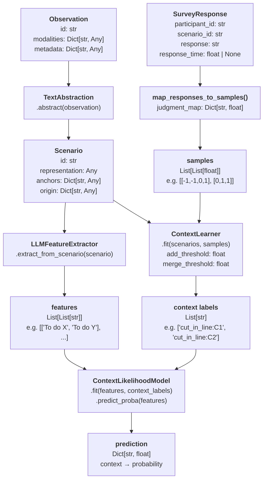

# COGEMI_RL
Contextual Organization of General Evaluation from Multimodal Inputs

A library for learning contextual, situational valence from human survey data.

Based on [COMETH_RL](link).

---

## Pipeline overview



### Training path
1. **Observe** — wrap raw input as `Observation` (text, image, etc.)
2. **Abstract** — `TextAbstraction` encodes modalities and extracts anchors → `Scenario`
3. **Collect responses** — human ratings as `SurveyResponse` objects
4. **Map to samples** — convert label strings to numerical rewards `{-1, 0, 1}`
5. **Learn contexts** — `ContextLearner` clusters scenarios by reward distribution (KL/JS divergence) → context labels
6. **Extract features** — `LLMFeatureExtractor` produces semantic feature labels per scenario
7. **Fit generalizer** — `ContextLikelihoodModel` learns feature → context mapping

### Inference path
`Observation` → `TextAbstraction` → `Scenario` → `LLMFeatureExtractor` → `ContextLikelihoodModel.predict_proba()` → `Dict[context, probability]`

---

## Key types

| Type | Location | Description |
|------|----------|-------------|
| `Observation` | `observe/observation.py` | Raw multimodal input |
| `Scenario` | `observe/scenario.py` | Abstracted situation with anchors |
| `SurveySpecification` | `survey/specification.py` | Instructions + response labels |
| `SurveyResponse` | `survey/survey_response.py` | One participant's rating of one scenario |
| `HumanSurveyEvaluator` | `evaluation/human_survey.py` | Aggregates CSV survey data |
| `ContextLearner` | `learning/context_learner.py` | MBRL context clustering |
| `LLMFeatureExtractor` | `features/extractor_llm.py` | Semantic feature extraction (stub/LLM) |
| `ContextLikelihoodModel` | `generalize/likelihood.py` | Feature→context likelihood model |
| `CogemiPipeline` | `api.py` | End-to-end pipeline wrapper |

### Context entry structure
```python
contexts_dict: {
    "action_name": {
        "C1": {
            "Distribution": {-1: float, 0: float, 1: float},  # normalized probability
            "Outcomes":     List[float],                        # raw reward samples
            "States":       List[[state_str, reward_samples]]  # provenance
        },
        "C2": { ... }
    }
}
```

### Scenario ID convention
`ContextLearner` expects `scenario.id` in format `"prefix_action_state"` (e.g. `"s_1_2"`), splitting on `_` to extract action (index 1) and state (index 2).

---

## Definitions

**Observation** — raw input with one or more modalities (text, image, sound) and metadata.

**Scenario** — abstracted description with a `representation` (e.g. text), `anchors` (e.g. `{"action": "cut_in_line"}`), and provenance `origin`.

**Context** — a cluster of scenarios with similar reward distributions for a given action. Represented as `{Distribution, Outcomes, States}`.

**Dilemma** — legacy term for a scenario with a pre-computed reward distribution: `{Action: str, State: str, Reward: List[int]}`.

---

## Installation

**Requirements:** Python 3.10+, and [Ollama](https://ollama.com/) running locally (or an OpenAI-compatible API).

```bash
# 1. Clone the repository
git clone https://github.com/trondarild/COGEMI_RL.git
cd COGEMI_RL

# 2. Create and activate a virtual environment
python -m venv .venv
source .venv/bin/activate   # Windows: .venv\Scripts\activate

# 3. Install the package and dependencies
pip install -e .
```

### LLM configuration

By default COGEMI uses a local Ollama server with the `qwen3:1.7b` model. Copy and edit `cogemi_config.yaml` to change provider or model:

```yaml
llm:
  provider: ollama          # or "openai"
  model: qwen3:1.7b
  base_url: http://localhost:11434
  # api_key: ""             # set here or via COGEMI_API_KEY env var
```

For an OpenAI-compatible API:

```bash
pip install openai
export COGEMI_API_KEY=sk-...
```

Then set `provider: openai` and your chosen `model` in `cogemi_config.yaml`.

### Running tests

```bash
# All tests (LLM tests auto-skip if Ollama is not running)
.venv/bin/python -m pytest tests/ -v

# Stub-only (no Ollama required, ~2 s)
.venv/bin/python -m pytest tests/ -v -k "not ollama"
```

---

## Examples
