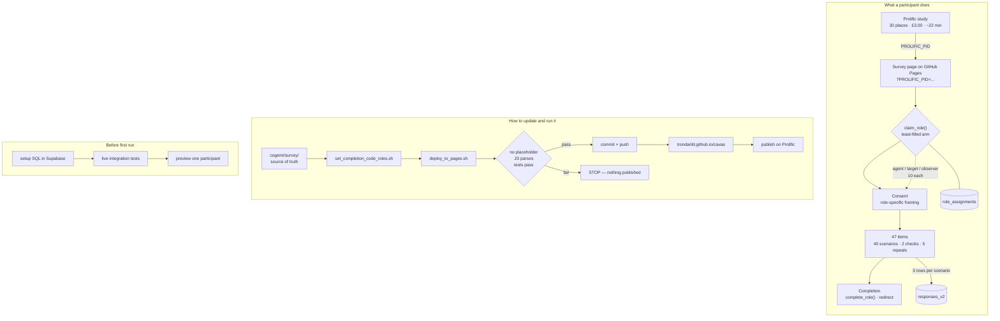

# Graphical overview — image-model prompt

A paste-ready prompt for generating a one-page diagram of the Prolific
survey: what a participant goes through, and what an operator does to update
and run it.

Image models render long text badly. Keep the label list short, expect to
correct spelling by hand afterwards, and treat the Mermaid source at the
bottom as the authority on structure.

---

## Prompt

> A clean two-panel technical diagram on a white background, flat vector
> style, thin dark grey lines, one accent colour (muted blue) used only for
> the participant path and one warm accent (amber) used only for validation
> gates. Sans-serif labels, generous whitespace, no drop shadows, no 3D, no
> photorealism. Landscape A3 proportions. Title at top: "COGEMI
> appropriateness survey — Prolific pilot".
>
> **Left panel, titled "What a participant does".** A vertical flow of
> rounded boxes connected by arrows, top to bottom:
>
> 1. A Prolific study card labelled "Prolific study — 30 places, £3.00,
>    ~22 min". An arrow leaves it carrying a small tag labelled
>    "PROLIFIC_PID".
> 2. A browser window labelled "Survey page (GitHub Pages)".
> 3. A database cylinder labelled "Supabase" off to the right, with a
>    round-trip arrow labelled "claim_role()". Beside it, three small
>    stacked bins labelled "agent 10", "target 10", "observer 10", with the
>    least-filled bin highlighted to show the draw picks it.
> 4. A box labelled "Consent — role-specific framing".
> 5. A box labelled "47 items: 40 scenarios, 2 attention checks, 5 repeats".
>    Beside it, a small callout listing five lines: "Q1 personal 1–5",
>    "Q2 injunctive 1–5", "Q3 empirical rarely/sometimes/often",
>    "confidence 1–5", "rank 3 aspects".
> 6. An arrow to the Supabase cylinder labelled "3 rows per scenario →
>    responses_v2".
> 7. A box labelled "Completion — complete_role(), redirect to Prolific".
>
> **Right panel, titled "How to update and run it".** A horizontal pipeline
> of rectangles, left to right, with three amber diamond-shaped gates in the
> middle:
>
> 1. A folder icon labelled "Source of truth: cogemi/survey/".
> 2. A rectangle labelled "set_completion_code_roles.sh CODE".
> 3. A rectangle labelled "deploy_to_pages.sh", feeding into the three amber
>    gates in sequence: "no placeholder", "JS parses", "tests pass". Each
>    gate has a small red arrow branching downward to a single box labelled
>    "STOP — nothing published".
> 4. A rectangle labelled "git commit + push".
> 5. A globe icon labelled "trondarild.github.io/cavaa".
> 6. A rectangle labelled "Publish on Prolific".
>
> Below that pipeline, a separate short row of three boxes under a small
> heading "Before first run": "Run setup SQL in Supabase", "Run live
> integration tests", "Preview one participant yourself".
>
> Bottom right, a small boxed note: "One study, not three — Prolific blocks a
> second submission to the same study, so the arms stay disjoint."
>
> Every arrow single-headed and unambiguous. No decorative icons beyond those
> named. No people, no robots, no glowing effects.

---

## Notes on using it

Generate a few variants and pick on layout rather than typography — the text
will need fixing whatever comes back. If the model crowds the left panel,
drop item 6 (the row-writing arrow) and fold it into item 5.

For a version that must be exactly right, render the Mermaid below instead
and use the image model only for a cover illustration.

---

## Reference structure

Sources: `cogemi/survey/appropriateness_survey_aspects_park_prolific_v2_roles.html`,
`cogemi/survey/appropriateness_survey_supabase_setup.sql`,
`cogemi/survey/deploy_to_pages.sh`, `data/prolific-survey-info-v2-roles.md`.
