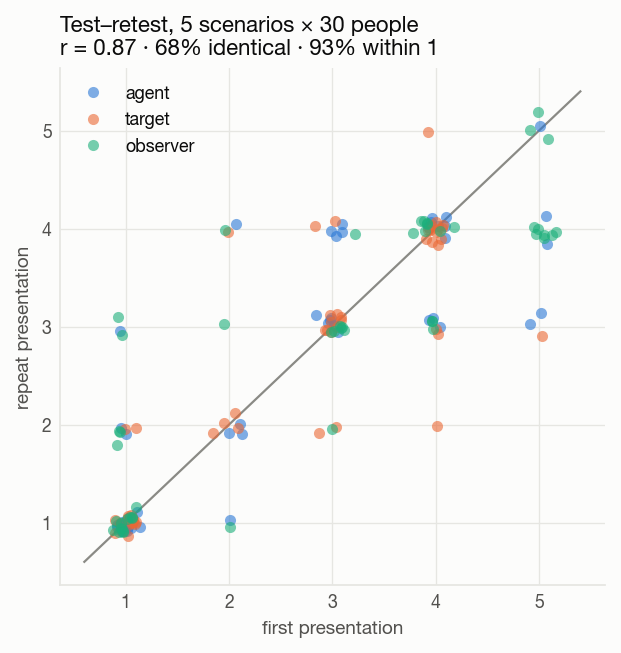
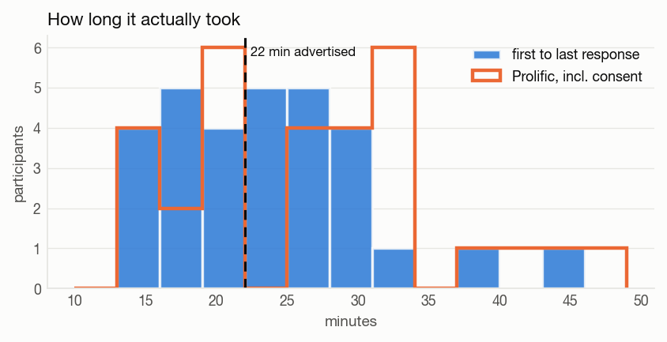
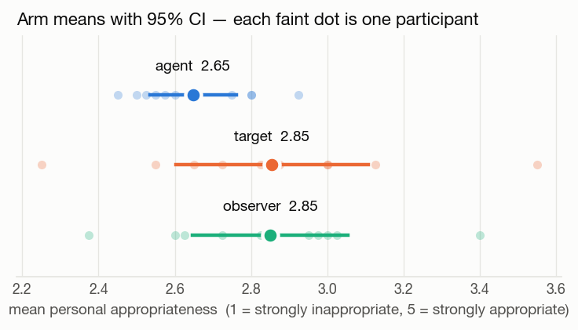
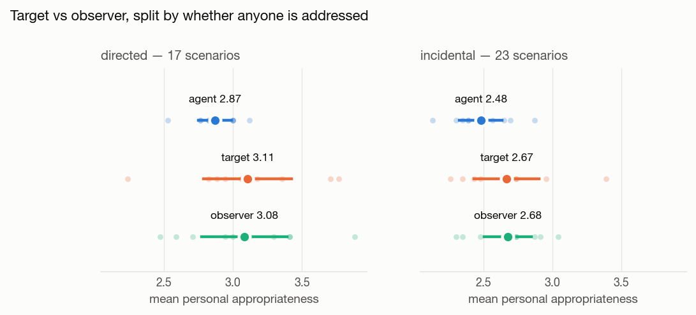
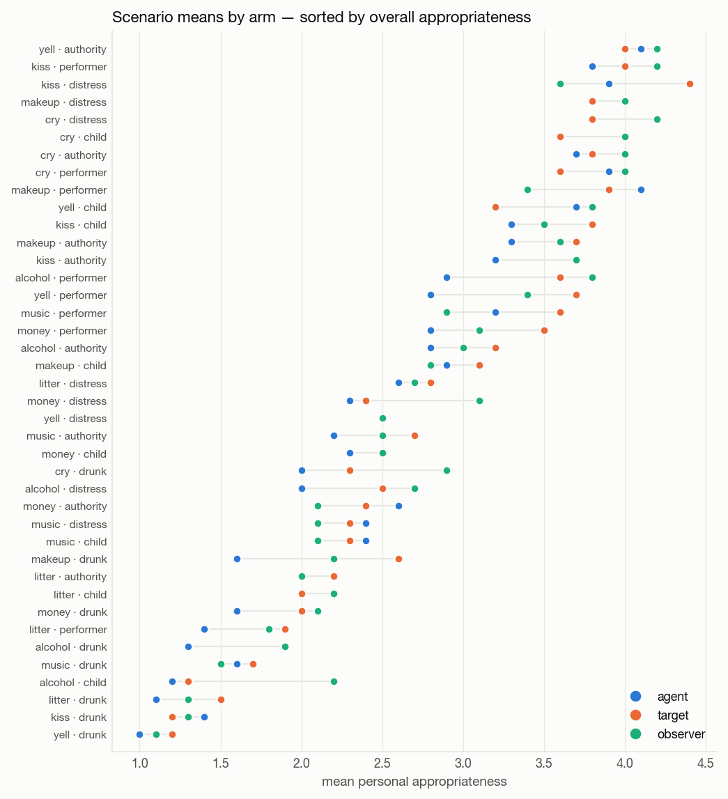
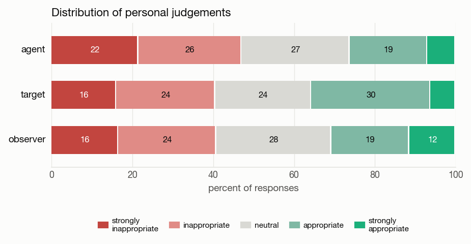
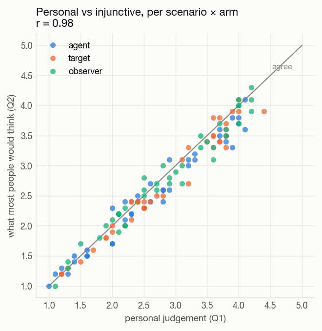
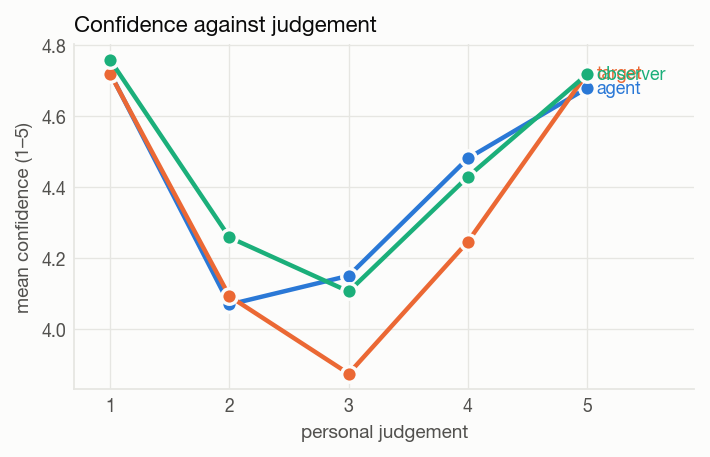
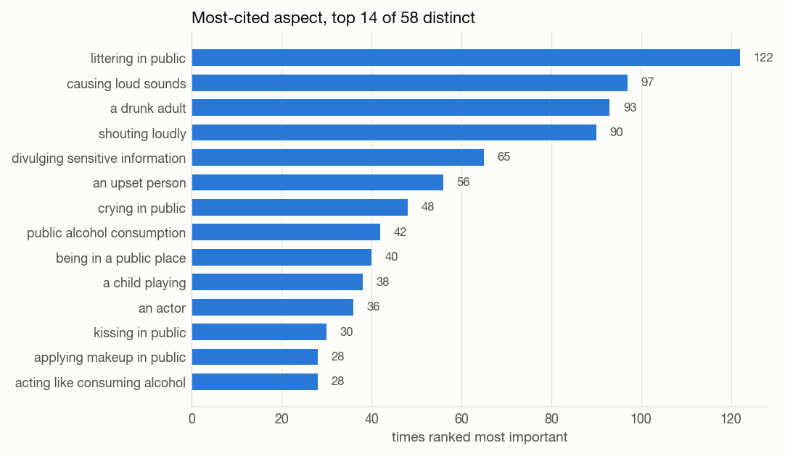
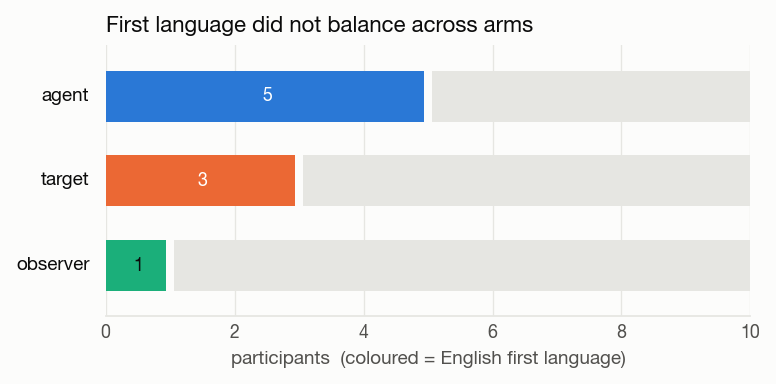

# Pilot statistics — v2 role router

Social appropriateness in a public park, 30 participants drawn into three
perspective arms. Fielded on Prolific 28 July 2026, study
`69f08cc2caaeabfc44670ea3`, completion code `CMZU9JD5`.

Figures and the script that makes them are in `statistics/pilot-analysis/`.
Regenerate with:

```
.venv/bin/python statistics/pilot-analysis/pilot_analysis.py
```

Data: `data/pilot-v2-roles/responses_clean.csv`, 4,350 rows. Demographics come
from the Prolific export, which is gitignored — it carries Prolific IDs, and
this repository is public. Participants appear throughout as an eight-character
md5 prefix, which is what the export RPC returns and what joins the two sources.

---

## What was run

One Prolific study rather than three, because Prolific's *previously
participated* prescreener is unreliable for concurrent studies while it does
structurally block a second submission to the same study. The arm is drawn
server-side at entry by `claim_role()`, which takes the least-filled bin under
an advisory lock.

It worked. Thirty places filled to exactly 10 / 10 / 10, no participant appears
in two arms, and one returned submission left no rows — its slot was reissued by
the two-hour reclaim rule.

Each participant saw 47 items: 40 scenarios (8 behaviours × 5 agent contexts),
2 attention checks, and 5 scenarios repeated at the end. Each item asked for a
personal judgement (Q1, 1–5), what most people would think (Q2, 1–5), how often
it actually happens (Q3, rarely/sometimes/often), a confidence rating, and a
ranking of three pre-written aspects. A perceived-disagreement item fired every
ten scenarios.

The target arm additionally saw a named position under each vignette — *"In this
situation you are: one of the joggers being shouted at."* About half the pool has
no addressee, so 17 scenarios are tagged `directed` and 23 `incidental`.

---

## Data quality

**Structure.** Every participant contributed exactly 145 rows except one, who
reloaded mid-session and re-answered 49. Same `session_id`, no gap over five
minutes, 42 minutes total — consistent with restarting after about sixteen
items. `responses_clean.csv` keeps the latest response per participant ×
scenario × norm type × repeat, giving 30 × 145. One reload in thirty is worth
carrying into the main study as an expected rate.

**Test–retest** is the strongest quality signal: r = 0.87 across the five
repeated scenarios, 68% of repeats identical to the first presentation and 93%
within one scale point. Participants are reproducing their own judgements, so
the instrument is measuring something stable rather than collecting noise.



**Attention checks** passed 27/30 and 26/30. The three failures on the
door-holding item were all *Neutral* rather than reversals, which is a
defensible reading of an unremarkable act; the check is softer than intended.
Only one participant reversed the queue-barging item outright.

Two participants deserve scrutiny:

- **866a9531** answered Neutral to both checks, rated 29 of 40 scenarios at the
  midpoint, and gave 3 to all five retest items — a flat responder rather than a
  fast one, since they spent 29.5 minutes. Their retest correlation is
  undefined because the repeat vector has no variance.
- **60720da3** rated queue-barging at a hospital reception *appropriate*, has a
  retest correlation of −0.47, and is the participant who restarted. They took
  44.5 minutes, so haste is not the explanation.

Excluding them moves nothing: the arm means are unchanged to two decimals and
the agent-versus-rest p-value shifts from 0.062 to 0.084 (the second exclusion
removes a target participant). Reported below on all 30; both are worth
excluding in the main study, where the same rules should be pre-registered
rather than chosen after seeing the data.

**Duration.** Median 23.7 minutes between first and last response, 27.9 by
Prolific's clock — the difference is consent and instructions. So the real
burden is about 28 minutes against 22 advertised, which made the effective rate
about £7.89/hour rather than the £10.00 shown. The main study should advertise
28 minutes and pay around £4.67.



---

## The arm comparison



| arm | mean Q1 | 95% CI | sd between participants |
|---|---|---|---|
| agent | 2.65 | ± 0.11 | 0.16 |
| target | 2.85 | ± 0.25 | 0.35 |
| observer | 2.85 | ± 0.21 | 0.29 |

The unit here is the participant, not the row. Each person contributes 40
scenarios, so treating 400 rows as 400 independent observations would give
intervals roughly six times too narrow. Ten participants per arm is what the
design actually bought.

One-way ANOVA across arms: F = 1.82, p = 0.18.

**Target and observer are indistinguishable** — 2.855 against 2.850, t = 0.03,
p = 0.97. That is the finding the pilot was built to produce, and it is a
negative one.

**Agent sits about 0.2 below both**, t = −1.94, p = 0.062, Cohen's d = −0.72.
Suggestive at this N, and not to be read as established. If it survives, it says
that imagining yourself performing an act makes you judge it more harshly than
watching it or receiving it — which is the opposite of a self-serving bias and
worth a hypothesis of its own.

### Split by whether anyone is addressed



| | agent | target | observer |
|---|---|---|---|
| directed (17 scenarios) | 2.87 | 3.11 | 3.08 |
| incidental (23 scenarios) | 2.48 | 2.67 | 2.68 |

The target anchors were added precisely so that target and observer would not
collapse into each other on the 23 scenarios where nobody is on the receiving
end. They collapse anyway — and they collapse on the directed items too, where
the anchor names a real addressee and the gap should have been largest.

Naming the position did not create a distinct perspective. Two readings, and
this pilot cannot separate them: either taking the target's view genuinely does
not change appropriateness judgements about public behaviour, or a one-line
anchor is too weak to induce the perspective. The second is testable — a
manipulation check asking who the participant had in mind would settle it, and
should go into the main study.

Both directedness levels shift together by about 0.4, so the directed/incidental
tag does separate the items even though it does not separate the arms. That
distinction is worth keeping.

---

## What actually varies



Scenario means run from 1.0 (a drunk adult shouting obscenities at joggers) to
4.2 (a PE teacher yelling instructions to their class). That is a 3.2-point
spread against a 0.2-point spread between arms — item variation is more than an
order of magnitude larger than perspective.

The ordering is coherent and reads as valid. The drunk-adult context occupies
almost the entire bottom of the chart across behaviours; performer and authority
contexts sit at the top. The same physical act — shouting — is the most
appropriate item in the set when a teacher does it to a class and the least when
a drunk does it at joggers. Context dominates behaviour, which is the premise the
instrument was built on.



No arm shows floor or ceiling compression, and all five scale points are used.
The agent arm's extra severity shows up as a heavier *strongly inappropriate*
tail (22% against 16%), not as a shift of the whole distribution.

---

## Personal against injunctive



Per scenario × arm, Q1 and Q2 correlate at r = 0.98, with Q2 sitting 0.10 below
Q1 on average.

This is the result most in need of thought. Bicchieri's distinction between what
I think and what I think others think only does work if the two can come apart;
here they barely do. Three possibilities. Participants may genuinely believe
their judgements are shared — plausible for park norms, which are not
contested. Or the questions may be too close together in the flow for the
distinction to register. Or Q2 may be reading as a rephrasing of Q1.

The near-zero gap in the pilot means the injunctive measure adds little at
present. Before the main study, decide whether to separate the two questions in
time, reword Q2 more sharply, or drop it and buy items instead.

Q3 (empirical expectation) does behave differently, and the rewording that
separated it from approval seems to have held: agent −0.20, target +0.06,
observer −0.18 on the −1/+1 scale. It is not tracking Q1.



Confidence is U-shaped in all three arms — around 4.7 at both ends of the scale
and 3.9–4.2 at the midpoint. People are least certain when they answer Neutral,
which is what you would want: the midpoint is being used for genuine ambivalence
rather than as an escape.

Perceived disagreement sits at 2.83 / 3.05 / 2.83 — participants expect moderate
disagreement, slightly more in the target arm.

---

## Aspect rankings



58 distinct aspects were ranked most important at least once. The leaders are
the act itself — littering, loud sounds, shouting — followed by agent state (a
drunk adult) and disclosure (divulging sensitive information). Generic framing
aspects like *being in a public place* rank first only 40 times across 1,200
rankings, which suggests participants are discriminating rather than defaulting
to the blandest option.

---

## The limit on all of the above



Nine of thirty participants have English as a first language, and they are not
spread evenly: 5 in agent, 3 in target, 1 in observer. Median age also differs —
31, 32 and 40.

The pool draw balances arm *sizes* exactly and does nothing about covariates.
At n = 10 an imbalance this size is ordinary chance, but it lands directly on the
one comparison the study exists to make: the agent arm is both the most severe
and the most native-English, and the two cannot be separated here.

So the agent effect is a hypothesis, not a result. Two ways forward, and they
combine: stratify the draw on first language — `claim_role()` would take a
stratum argument without much surgery — and carry language and age as covariates
in the model.

---

## For the main study

1. **Stratify the role draw** on first language, and record language at entry
   rather than reconstructing it from the Prolific export afterwards.
2. **Add a manipulation check** for the target arm — ask who the participant had
   in mind. Without it, the null result for target versus observer cannot be
   read.
3. **Reconsider Q2.** At r = 0.98 with Q1 it is close to redundant. Separate,
   reword, or drop.
4. **Advertise 28 minutes** and pay accordingly.
5. **Pre-register the exclusion rules** before collecting: both attention checks
   failed, or a flat-response profile like `866a9531`'s, or duration under some
   floor. The door-holding check needs replacing with something that has a
   clearer wrong answer.
6. **Power.** The binding N from the Dirichlet simulation was 50, and the
   contextual claims need 10 vignettes per cell — 120 total vignettes, not more
   participants. Nothing here contradicts that. If the agent effect (d ≈ 0.7) is
   the target, roughly 34 per arm gives 80% power, so about 100 participants; the
   50 from the simulation is not enough for a three-arm comparison at this
   effect size.
7. **Handle reloads.** One in thirty restarted. Either persist progress in
   `localStorage`, or deduplicate on the latest response as
   `responses_clean.csv` does — but decide before the data arrive.

---

## Figures

| file | shows |
|---|---|
| `01-arm-means.png` | Q1 by arm, participant-level with 95% CI |
| `02-directedness.png` | the same, split by directed / incidental |
| `03-scenario-means.png` | all 40 scenarios by arm, sorted |
| `04-personal-vs-injunctive.png` | Q1 against Q2 per scenario × arm |
| `05-response-distribution.png` | scale use by arm |
| `06-test-retest.png` | first against repeat presentation |
| `07-duration.png` | in-survey and Prolific timings |
| `08-confidence.png` | confidence against judgement |
| `09-aspects.png` | most-cited aspect, top 14 |
| `10-language.png` | first language by arm |
